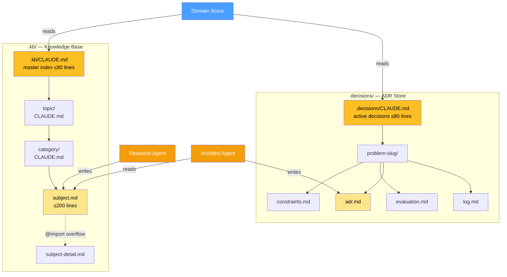
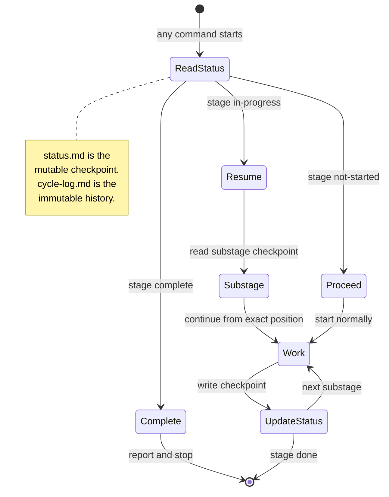
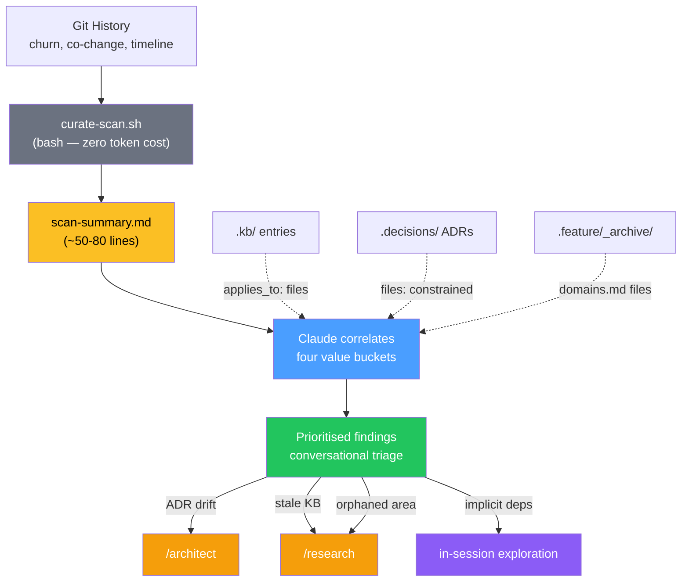

# vallorcine — Design Document

This document describes the design philosophy, core patterns, and structural
decisions behind vallorcine. It is intended for anyone extending the kit,
debugging unexpected agent behaviour, or evaluating whether to adopt it.

---

## What this is

A reliable engineering partner for Claude Code — persistent knowledge,
structured decisions, TDD guardrails, and a conversational flow that enforces
the process you want without the friction you don't. Each feature shipped makes
the next one faster because the project's context compounds across sessions.

Organised around six concerns:

**Knowledge** — a pull-model knowledge base (`.kb/`) maintained by the Research
Agent. Research findings accumulate across features and are queried on demand.
The KB is independent of any particular feature or decision — it stores what
the project knows.

**Decisions** — an architecture decision store (`.decisions/`) maintained by the
Architect Agent. Each decision goes through a deliberation loop with constraint
profiling, candidate evaluation, and explicit confirmation. Decisions are the
project's governance layer — they record not just what was chosen but why, what
alternatives were rejected, and when to revisit.

**Specifications** — an operational specification store (`.spec/`) maintained by
the Spec Author. Each spec goes through a two-pass adversarial authoring process:
structured drafting followed by falsification. Specs describe observable
behavioral contracts — what must be true — without referencing specific
implementation structures. They are the authoritative reference for what the
system guarantees, consumed by the work planner, test writer, and audit pipeline.
Domain-sharded directories with a manifest registry enable deterministic context
resolution via bash scripts. Specs have a full lifecycle: DRAFT → APPROVED →
INVALIDATED. **Displacement detection** in the resolver identifies when new
specs contradict existing ones, and the pipeline carries removal work through
planning, testing, implementation, and artifact finalization. INVALIDATED specs
are preserved with cross-references (`displaced_by`, `displacement_reason`) for
historical inspection. **Revival** allows new specs to be authored using
INVALIDATED predecessors as reference input (`revives` / `revived_by`).

**Features** — a staged TDD pipeline that takes a feature description through
scoping, domain analysis, work planning, test writing, adversarial hardening,
implementation, refactor, PR preparation, and retrospective. Each stage is a
separate slash command backed by a named agent. The hardening phase applies
audit-derived domain lenses (lifecycle, concurrency, boundaries, transformation)
to contracts pre-implementation, writing adversarial tests that define defensive
requirements the spec didn't anticipate. Features read from the knowledge,
decisions, and specifications layers during domain analysis and work planning,
and write back via retrospectives — creating a feedback loop that makes the
project layer richer with every feature completed.

**Curation** — a correlation engine (`.curate/`) that combines vallorcine's
structured history with git data to find things that individual features,
decisions, and research sessions couldn't see because they each had a narrower
scope. Detects ADR drift, stale research, spec-code divergence, implicit
dependencies between features, and orphaned areas with no structured knowledge.
`/curate` surfaces findings conversationally and routes to existing commands
for resolution.

**System** — setup, upgrade, project context, and help. One-time configuration
(`/setup-vallorcine`), ongoing maintenance (`/upgrade-vallorcine`,
`/project-context`, `/feature-cleanup`), and entry point routing (`/vallorcine-help`).

The knowledge, decisions, and specifications layers are the durable assets.
Features come and go, but KB entries, ADRs, specs, and project context persist
and compound. Curation closes the loop — it detects when those assets need
updating based on how the codebase has evolved. This is what makes the 5th
feature on a project faster than the 1st.

---

## Core design principles

Ordered by priority. When principles conflict, higher-numbered principles yield
to lower-numbered ones. Each principle notes what breaks if it is violated.

### 1. Bash-first, zero required dependencies

No feature in the kit may require Python, Node.js, or any other runtime beyond
bash and markdown. A developer with Claude Code and a terminal can run
vallorcine on any project in any language immediately — this guarantee is
non-negotiable.

The core kit is bash and markdown:
- `install.sh` is a bash script that copies markdown files
- Commands are markdown prompt files read by Claude Code
- Agents are markdown identity definitions
- Rules are markdown files loaded by convention
- Scripts are bash — `token-usage.sh`, `version-check.sh`, etc.
- State is markdown files — `status.md`, `cycle-log.md`, `CLAUDE.md` indexes

**Enhanced implementations** in Python and JavaScript are permitted when bash
cannot fully serve the user — but only under strict rules:

1. **No feature may exist only in Python or JavaScript.** Every capability must
   have a bash implementation or a safe fallback that preserves the feature's
   core value. The bash version is the reference implementation.
2. **Enhanced versions must be provided in both Python and JavaScript.** The kit
   does not pick winners among user ecosystems. If one gets an upgrade, both do.
3. **Detection and degradation must be automatic.** If a runtime is available,
   use it silently. If not, fall back silently. No install prompts, no error
   messages, no degraded-experience warnings.

Two justifications clear the bar for enhanced implementations:

- **Platform constraint** — bash cannot access the data. Example: Claude Code's
  SDK-level hooks expose subagent activity that shell hooks cannot see. The
  status line and todo rendering need this data for accurate real-time state.
  No amount of bash sophistication can bridge the gap — it is an API surface
  boundary.

- **Practical constraint** — bash can technically do it, but the implementation
  would be so degraded in performance, maintainability, or output quality that
  it undermines the purpose of the feature. Example: processing hundreds of
  megabytes of structured JSONL through tokenization, AST construction, and
  formatted rendering. Bash could attempt this, but the result would be slow,
  fragile, and unmaintainable — worse for users than shipping a Python/JS
  implementation alongside the existing bash-based real-time data.

The **third-party tool test** is the tiebreaker: if the alternative to shipping
an enhanced implementation is telling users "download this external tool to get
these diagnostics," then the kit should ship it with graceful degradation. That
creates less adoption friction than an external dependency.

When evaluating new features, this is still the first filter: build it in bash.
If bash cannot fully serve the need, check the two justifications above. If
neither applies — if the real reason is "this would be easier in Python" — it
does not belong in the kit as an enhanced implementation. Convenience is not a
justification; capability boundaries and user-facing quality are.

**If violated (required dependency):** the kit gains an installation
prerequisite that gates adoption. Every required dependency is a reason for a
developer to not use vallorcine.

**If violated (unjustified enhancement):** the kit accumulates Python/JS code
that could have been bash, creating maintenance burden across three languages
without user-facing benefit. The bar stays high to prevent this drift.

### 2. Pull model throughout

Nothing loads automatically except the rules in `.claude/rules/` and the root
`CLAUDE.md`. The KB, decision records, feature work files, and agent command
definitions all load on demand only — when Claude explicitly navigates to them.

This means a project with 200 KB entries, 50 ADRs, and 10 active features pays
essentially zero token overhead at session start. The always-loaded footprint is
intentionally fixed: root `CLAUDE.md` (~30 lines) + four rules files (~120 lines
combined). It stays fixed forever regardless of how much content accumulates.

The pull model is enforced by three mechanisms:
- `.kb/` and `.decisions/` are never scanned proactively (rules file prohibits it)
- Slash commands load only the files they need for their specific stage
- Subdirectory `CLAUDE.md` files serve as lazy-loaded indexes rather than
  auto-loaded content

**If violated:** token cost grows with content volume. A project with rich KB
and decision history becomes slower and more expensive to use with every entry
added — the opposite of the intended compounding effect.

### 3. Context is expensive — size every file accordingly

Token cost shapes every structural decision in this kit:

- Always-loaded files (`CLAUDE.md`, rules) are capped and pointer-only
- Index files (`.kb/CLAUDE.md`, `.decisions/CLAUDE.md`) have 80-line hard caps
  with archival rules that enforce them
- Subject files (`.kb/<topic>/<category>/<subject>.md`) are capped at 200 lines
  with overflow extracted to `<subject>-detail.md` via `@import`
- The Work Planner loads only ADR sections and KB key-parameters, not full files
- The Code Writer loads only stub files and test files relevant to the current
  work unit, not the entire feature

The token estimation in the Work Planner's work unit analysis (Step 2b) is a
direct expression of this principle: split only when the savings justify the
overhead. The crossover is ~15K for a single Code Writer session.

**If violated:** individual operations become token-expensive even when the pull
model is respected. A single oversized file can blow the context budget for a
Code Writer session, causing truncation or degraded output quality.

### 4. File-based state, not in-memory state

Claude has no memory between sessions. Everything that needs to survive a session
boundary — current stage, substage, cycle count, work unit status, in-progress
drafts — lives in `.feature/<slug>/status.md`.

`status.md` is updated in-place throughout the pipeline. It is the restart
checkpoint. Every command reads it first and derives its behaviour from it.

`cycle-log.md` is the complement: append-only narrative history. It never lies
about what happened, because nothing is ever deleted from it. `status.md` tells
you where you are; `cycle-log.md` tells you how you got there.

This separation — mutable checkpoint + immutable history — is the same pattern
used in write-ahead logs and event sourcing. It gives idempotency for free:
read the checkpoint, if work is already done, stop.

**If violated:** work is lost on session end, context overflow, or crash. The
pipeline cannot be resumed — every interruption requires starting over from
scratch, wasting tokens and developer time.

### 5. Idempotency at every stage

Every command starts by reading `status.md` and checking whether its stage is
already complete. If it is, it reports and stops. No command re-does completed
work without explicit user confirmation.

This makes every command safe to re-run after a crash, a timeout, or an
accidental double-invocation. The pipeline is designed to be interrupted at any
point and resumed cleanly.

The idempotency pattern is:
```
1. Read status.md
2. If stage complete → report and stop
3. If stage in-progress → resume from substage
4. If stage not-started → proceed normally
```

**If violated:** duplicate work on re-run — tests written twice, implementations
overwritten, cycle counts inflated. Crash recovery becomes unreliable, and users
lose confidence that interruptions are safe.

### 6. Tests are the specification

Test files are written before implementation and may never be modified by the
Code Writer. If the implementation can't satisfy a test, that is a signal that
the contract is wrong — handled by escalation to the Test Writer, not by
changing the test to fit the implementation.

This enforces genuine TDD rather than test-after development. The Test Writer
writes tests against work-plan contracts. The Code Writer implements against
those tests. The test files are the ground truth.

**If violated:** TDD degrades into test-after development. The Code Writer shapes
tests to fit implementation rather than implementing to satisfy contracts. Test
coverage becomes a formality rather than a specification.

### 7. Write authority is strictly partitioned

Each agent writes only to its designated files. No agent writes to another
agent's output files. This is enforced by explicit rules in each command file
and agent definition, not by technical access controls.

```
Agent              Writes to
─────────────────────────────────────────────────────
Scoping Agent    → .feature/<slug>/brief.md
Domain Scout     → .feature/<slug>/domains.md
Work Planner     → .feature/<slug>/work-plan.md + stub files in src/
Test Writer      → test files + cycle-log.md (test entries)
Code Writer      → implementation files + cycle-log.md (code entries)
Refactor Agent   → implementation files + cycle-log.md (refactor entries)
PR command       → .feature/<slug>/pr-draft.md
Research Agent   → .kb/ only
Architect Agent  → .decisions/ only (reads .kb/)
All agents       → .feature/<slug>/status.md (stage updates only)
```

Escalation paths exist for the cases where one agent discovers a problem that
belongs to another's domain:
- Code Writer finds a contract conflict → escalates to Test Writer (does not modify tests)
- Refactor Agent finds missing tests → escalates to Test Writer (does not write tests)
- Test Writer needs a contract change → escalates to Work Planner (does not modify stubs)

**If violated:** agents silently overwrite each other's work. Escalation paths
break down — problems get papered over instead of surfaced. The pipeline loses
its separation of concerns and becomes a single monolithic agent with extra steps.

### 8. Human confirmation before irreversible writes

Two agents never write their primary output without explicit user confirmation:

**Architect Agent** — presents a defence summary in chat, runs a deliberation
loop, and writes `adr.md` only after the user says "confirmed." An ADR written
without deliberation is not a decision — it's an assumption.

**Scoping Agent** — presents the full feature brief in chat and waits for
confirmation before writing `brief.md`. Brief corrections are cheap; scope
corrections mid-implementation are not.

All other agents write their outputs as part of their normal execution, but
the handoff prompts between stages ("Continue? yes / no") give the user a
review checkpoint before each stage begins.

**If violated:** incorrect scope or flawed architectural decisions propagate
through the entire pipeline before being caught. The cost of correction
multiplies with each downstream stage that builds on the mistake.

### 9. Agents are routers, not autonomy machines

The pipeline is explicitly staged and human-paced. Agents do not chain
automatically — they present their output, ask for confirmation, and either
invoke the next sub-agent or stop and give the user a command to run manually.

The `--unit` flag and work unit progression follow the same pattern: the
Refactor Agent reports unit completion and asks whether to continue to the next
unit's test writing. The user stays in the loop at every inter-stage boundary.

`/vallorcine-help` is the clearest expression of this: it reads context, asks one
question, and hands the user a pre-filled command. It never does pipeline work
itself. It is a router, not an agent.

**If violated:** the pipeline runs ahead of the user's understanding. Errors
compound silently across stages. The user loses the ability to course-correct
at natural checkpoints, turning a collaborative tool into an unpredictable one.

### 10. Agents own the files — users don't edit them directly

Every file written by the kit — `.kb/CLAUDE.md`, `.decisions/CLAUDE.md`,
`status.md`, `brief.md`, ADRs, subject files, index files — carries a managed-by
notice at the top. The notice names the command to use instead of hand-editing.

This is not a technical restriction. It is a workflow discipline. Manual edits
bypass the safety checks agents perform (idempotency reads, cap enforcement,
index consistency, append-only log rules). A manually edited `status.md` can
put the pipeline in an unrecoverable state. A manually edited `.kb/CLAUDE.md`
can break topic resolution in `/research`.

The rule: if you want something to change in a kit-managed file, there is a
slash command for it. If there isn't, that is a gap in the kit — add a command
rather than editing the file directly.

**If violated:** kit-managed files drift into inconsistent states. Index files
disagree with directory contents, status checkpoints lie about pipeline position,
cap enforcement stops working. Recoverable, but requires manual investigation.

---

## Diagrams

### TDD inner loop and escalation paths


Escalations are strict — an agent never writes to another agent's files.
The Code Writer cannot modify tests; the Refactor Agent cannot write tests;
the Test Writer cannot modify stubs. Each escalation crosses a boundary
that requires the responsible agent to act.

### Knowledge layer architecture



Navigation is top-down when reading (root → topic → category → subject)
and bottom-up when writing (category → topic → root index update). Neither
direction loads more than the navigation path. `.decisions/` links to `.kb/`
via relative paths; `.kb/` never links back — knowledge is independent of
any particular decision.

### Crash recovery model



Every command is idempotent. Re-running after a crash reads the checkpoint,
determines where work stopped, and resumes from that exact substage.
No command re-does completed work without explicit user confirmation.

---

## Structural patterns

### The `.feature/<slug>/` directory

Every feature gets its own directory under `.feature/`. The directory is
gitignored (scratch space); only `project-config.md` and `CLAUDE.md` are
committed (team-shared configuration).

```
.feature/<slug>/
  status.md      ← mutable restart checkpoint (updated in-place)
  brief.md       ← Scoping Agent output (immutable after confirmation)
  domains.md     ← Domain Scout output
  work-plan.md   ← Work Planner output (stubs + contracts)
  cycle-log.md   ← append-only narrative history
  pr-draft.md    ← PR Draft output
```

After the PR merges, `/feature-complete` moves the directory to
`.feature/_archive/<slug>/` (also gitignored, local only).

### The status.md checkpoint fields

```markdown
## Current Position
Stage:     <scoping | domains | planning | testing | implementation | refactor>
Substage:  <fine-grained position within the stage>
Last successful checkpoint: <human-readable description>

## Work Units         ← only present if feature was split
| Unit | Name | Constructs | Depends On | Status | Cycle |

## TDD Cycle Tracker
| Cycle | Unit | Tests written | Tests passing | Refactor done | Missing tests |
```

The substage field enables intra-stage crash recovery — the Refactor Agent
stores which checklist item it was on (2a through 2h) so it can resume exactly
where it stopped.

### Work units

When the Work Planner identifies that a feature has more than ~4 constructs with
a clean dependency boundary (groups that don't depend on each other within the
feature), it proposes splitting into work units. Each unit runs its own
test → implement → refactor cycle independently.

The decision rule is explicit and token-based:
- Single-unit load = N constructs × 3.5K tokens
- Split when single-unit load > 15K AND at least one clean boundary exists
- Never split 1–3 constructs regardless of boundaries

Work units give the Code Writer a bounded context window per session instead of
loading the entire feature at once. The savings are real at 6+ constructs:
~28K single-unit vs ~8-10K per unit session.

Integration tests (2f in the refactor checklist) are deferred until the final
work unit's refactor pass, since they require the complete feature to be in place.

### The KB hierarchy

```
.kb/
  CLAUDE.md                    ← master index, ≤80 lines, lazy-loaded
  _refs/                       ← shared reference fragments (@imported)
  <topic>/
    CLAUDE.md                  ← topic index, lazy-loaded
    <category>/
      CLAUDE.md                ← category index + comparison + gaps, lazy-loaded
      <subject>.md             ← full research, ≤200 lines, read explicitly
      <subject>-detail.md      ← overflow, @imported from subject file
```

The Research Agent navigates this hierarchy bottom-up when writing (category →
topic → root) and Claude navigates it top-down when reading (root → topic →
category → subject). Neither direction loads more than the navigation path.

### The decisions hierarchy

```
.decisions/
  CLAUDE.md                    ← active decisions only, ≤80 lines
  history.md                   ← archived rows, lazy-loaded, grows freely
  <problem-slug>/
    constraints.md             ← six-dimension constraint profile
    research-brief.md          ← Research Agent commission (if needed)
    evaluation.md              ← scored candidate matrix with KB links
    adr.md                     ← confirmed decision record
    log.md                     ← append-only history + deliberation summaries
```

`.decisions/` files always link to `.kb/` files via relative paths. `.kb/`
files never link back to `.decisions/` — knowledge is independent of any
particular decision that uses it.

### The curation layer

```
.curate/
  curation-state.md    ← last-scanned SHA + review log (mutable)
  scan-summary.md      ← latest scan output (gitignored, regenerated each run)
```

`.curate/` is gitignored — curation state is per-developer, not shared.
The artifacts it routes you to (KB entries, ADRs) are the committed assets.

Curation is a **correlation engine**, not a data store. It combines three
signal sources to find things no single source reveals:

1. **Vallorcine artifacts** — feature briefs, domains.md, work plans, ADRs,
   KB entries, test files. High-quality, structured, trustworthy.
2. **Git history** — churn hotspots, co-change patterns, commit timeline.
   Medium-quality, noisy but useful for change patterns.
3. **Derived correlations** — the actual value. ADR constrained area changed
   → flag for re-evaluation. KB entry aged while covered area churned → stale
   research. Features designed independently but touching shared files → implicit
   dependency risk.

The scanning cost is paid by bash (`curate-scan.sh`), not Claude. The script
produces a bounded summary (~50-80 lines) that Claude reads and correlates.
Token cost for a curation session: summary file + specific artifacts Claude
decides to deep-read based on findings.



**Four value buckets:**

| Bucket | Signal | Routes to |
|--------|--------|-----------|
| ADR drift | Code diverging from a decision | `/architect` review |
| KB + hindsight | Stale research + implementation evolution | `/research` refresh |
| Implicit dependencies | Cross-feature gaps in shared files | In-session exploration |
| Orphaned areas | High-churn with no KB/ADR coverage | `/research` or `/architect` |

**Artifact enrichment** enables grep-based correlation:
- ADR `adr.md` has a `files:` frontmatter field listing constrained files
- KB subject files have an `applies_to:` field for relevant file paths
- Feature archive `domains.md` already has file lists
- `curate-scan.sh` greps these fields against changed files — fast, bounded

**Scale safety:**
- Default scan: 3 months or 500 commits (whichever is smaller)
- Incremental: after first run, only scans delta from last-scanned SHA
- Large commits (50+ files) excluded from co-change analysis

---

## Token budget at a glance

| What loads | When | Approx. tokens |
|------------|------|----------------|
| Root `CLAUDE.md` | Every session | ~400 |
| `.claude/rules/*.md` (4 files) | Every session | ~1,500 |
| `.feature/project-config.md` | Each pipeline command | ~1,000 |
| `.feature/<slug>/status.md` | Each pipeline command | ~500–1,000 |
| `.feature/<slug>/brief.md` | Domain Scout, Work Planner, Test Writer | ~2,000 |
| `.feature/<slug>/domains.md` | Work Planner | ~3,000 |
| One ADR file | Work Planner, Domain Scout | ~2,000–4,000 |
| One KB subject file | Domain Scout, Architect | ~3,000–5,000 |
| Work-plan (single unit section) | Test Writer, Code Writer | ~2,000 |
| Test files (per unit) | Code Writer | ~2,000–3,000 |
| Stub files (per unit) | Code Writer | ~1,000–2,000 |
| `cycle-log.md` | Status, Resume commands | ~1,000 per cycle entry |
| `.curate/scan-summary.md` | `/curate` | ~1,000–2,000 |
| Correlated artifacts (per item) | `/curate` deep-read | ~2,000–4,000 |

Session start (always paid): ~2,000 tokens, fixed forever.
A typical Code Writer session (single work unit): 6,000–10,000 tokens.
A typical Code Writer session (pre-split, large feature): 15,000–30,000 tokens.

---

## What this kit is not

**Not an autonomous agent loop.** Commands do not chain without user
confirmation. The pipeline is staged and human-paced by design.

**Not a code generator.** The Work Planner writes stubs (contracts with no
implementation). Implementation is the Code Writer's job, guided by tests.

**Not a replacement for code review.** The Refactor Agent's security and
quality checks are a first pass, not a substitute for human review. The PR
draft explicitly includes a review checklist for that reason.

**Not opinionated about language or framework.** Project configuration
(`project-config.md`) is captured at setup time and used to parameterise
agent behaviour. The stub templates cover Python, TypeScript, Go, and Java but
the pattern applies to any language with typed interfaces.

---

## Extension points

**Adding a new pipeline stage** — create a skill directory in `.claude/skills/`
with a `SKILL.md` following the idempotency pattern (read status.md first, check
stage, update substage throughout), add write authority to `tdd-protocol.md`, add
the stage to the status file template in `feature/SKILL.md`.

**Adding a new KB topic** — no structural change needed. The Research Agent
creates topic directories on first use when a facet plan calls for a new topic.

**Research and KB search** — `/research "<subject>"` takes only a subject
description; the agent determines placement after preliminary web research and
a BM25-ranked KB scan (`kb-search.sh`). Cross-cutting subjects are decomposed
into focused facets at distinct locations. The search script provides ranked
results to all callers (`/kb` queries, `/research` pre-scan, `/curate`
relationship discovery).

**Adding a new agent** — create an agent definition in `.claude/agents/`,
a skill directory in `.claude/skills/`, and optionally a rule file in
`.claude/rules/` if the agent needs identity rules loaded every session.
Keep the rule file under 30 lines — it is always loaded.

**Adjusting work unit thresholds** — the 15K crossover and per-construct token
weights are in Step 2b of `feature-plan.md`. Adjust them if your project's
files are consistently larger or smaller than the defaults.

---

## Known team issues

Vallorcine is designed for single-developer use. Team usage works but has known
edge cases. Pre-flight checks (version skew, KB freshness, merge driver setup)
run automatically at pipeline start and handle the most common issues.

### Mitigated

**Index merge conflicts** — `.kb/CLAUDE.md` and `.decisions/CLAUDE.md` are the
narrow conflict surface when multiple developers add KB entries or decisions
concurrently. A custom git merge driver (`merge-driver-index.sh`) auto-resolves
these by keeping all rows from both sides. Registered automatically on first
pipeline command via `ensure-merge-driver.sh`. Scoped via `.gitattributes` to
only vallorcine-managed index files — never affects user code.

**Stale KB reads** — `kb-freshness-check.sh` warns at pipeline start when the
current branch's KB or decisions indexes are behind main. Advisory only.

**Version skew** — `version-check.sh` warns when vallorcine version on the
current branch differs from main.

**ADR contradiction** — `adr-validate.sh` warns at pipeline start when two
accepted ADRs share the same slug. Catches the case where two developers
independently accept conflicting decisions that the merge driver lands cleanly.

### Known but not yet mitigated

**Same feature slug on different branches** — `.feature/<slug>/` is gitignored,
so two developers using the same slug have silently divergent local state with
no merge signal. Low probability — avoid by convention: one developer per feature
slug. Branch names include the slug, so `git branch --list` reveals collisions.

**project-config.md overwrite** — running `/setup-vallorcine` on separate branches
with different answers causes a merge conflict. Fix is convention: run
`/setup-vallorcine` once on main before branching.

---

## File manifest

```
vallorcine/
│
├── DESIGN.md                        ← this file
├── CONTEXT.md                       ← active session state (bounded ~150-200 lines)
├── SETTLED.md                       ← graduated design history (pull-model reference)
├── COMPETITIVE.md                   ← market positioning (pull-model reference)
├── DEFERRED.md                      ← good-but-not-now ideas (pull-model, local dev only)
├── MANIFEST                         ← list of all kit-managed files (used by upgrade.sh)
├── install.sh                       ← installs to .claude/, .kb/, .decisions/
├── upgrade.sh                       ← downloaded into .claude/; applies new releases
│
├── skills/                          ← slash commands as Claude Code skills
│   │
│   │  Knowledge
│   ├── kb/SKILL.md                  ← /kb — query, lookup, create topics
│   ├── research/SKILL.md            ← /research — KB research session
│   │
│   │  Decisions
│   ├── architect/SKILL.md           ← /architect — architecture decision session
│   ├── decisions/SKILL.md           ← /decisions — query, list, explain, review, backfill, candidates, triage, defer, close, roadmap
│   │
│   │  Features
│   ├── feature/SKILL.md             ← /feature — scoping interview
│   ├── feature-quick/SKILL.md       ← /feature-quick — small changes, single session
│   ├── feature-domains/SKILL.md     ← /feature-domains — KB/ADR survey, auto-invokes architect/research
│   ├── feature-plan/SKILL.md        ← /feature-plan — work plan + stubs + execution strategy
│   ├── feature-coordinate/SKILL.md  ← /feature-coordinate — parallel batch coordinator
│   ├── feature-test/SKILL.md        ← /feature-test [--unit] — write failing tests
│   ├── feature-implement/SKILL.md   ← /feature-implement [--unit] — implement to green
│   ├── feature-refactor/SKILL.md    ← /feature-refactor [--unit] — quality review (2a-2h)
│   ├── feature-pr/SKILL.md          ← /feature-pr — PR draft + gh pr create
│   ├── feature-retro/SKILL.md       ← /feature-retro — post-feature retrospective
│   ├── feature-complete/SKILL.md    ← /feature-complete — post-merge archival
│   ├── feature-resume/SKILL.md      ← /feature-resume [--status] [--share] — crash recovery + briefing
│   ├── feature-cleanup/SKILL.md     ← /feature-cleanup — review stale feature directories
│   │
│   │  Audit
│   ├── audit/SKILL.md               ← /audit — adversarial bug finding with budget-aware prove-fix loop and Phase 0 already-fixed detection
│   │
│   │  Capabilities
│   ├── capabilities/SKILL.md        ← /capabilities — project capability index with domain hierarchy, types, and feature mapping
│   │
│   │  Curation
│   ├── curate/SKILL.md              ← /curate — codebase quality review, correlation engine
│   │
│   │  System
│   ├── vallorcine-help/SKILL.md     ← /vallorcine-help — entry point, router, question answering
│   ├── setup-vallorcine/SKILL.md    ← /setup-vallorcine — initialise KB and decisions structure
│   ├── upgrade-vallorcine/SKILL.md  ← /upgrade-vallorcine — check and apply kit updates
│   ├── project-context/SKILL.md     ← /project-context — team-shared codebase knowledge
│
├── agents/                          ← agent identity definitions
│   ├── scoping-agent.md
│   ├── domain-scout-agent.md
│   ├── work-planner-agent.md
│   ├── test-writer-agent.md
│   ├── code-writer-agent.md
│   ├── refactor-agent.md
│   ├── research-agent.md
│   ├── architect-agent.md
│   ├── spec-analyst-agent.md
│   ├── breaker-agent.md
│   └── constrained-refactorer-agent.md
│
├── rules/                           ← always-loaded identity + protocol rules
│   ├── tdd-protocol.md              ← pipeline order, write authority, idempotency rule
│   ├── kb-protocol.md               ← pull-model rules for KB and decisions
│   ├── kb-research-agent.md         ← Research Agent identity
│   └── kb-architect.md              ← Architect Agent identity
│
├── scripts/                         ← shell scripts (installed to .claude/scripts/)
│   ├── token-usage.sh               ← per-phase token tracking via session JSONL
│   ├── version-check.sh             ← warns if branch vallorcine version is behind main
│   ├── kb-freshness-check.sh        ← warns if KB/decisions indexes are behind main
│   ├── kb-search.sh                ← BM25-ranked KB search (wrapper: python3 → node → bash)
│   ├── kb-search.py                ← BM25 search implementation (Python)
│   ├── kb-search.js                ← BM25 search implementation (Node.js)
│   ├── merge-driver-index.sh        ← git merge driver for CLAUDE.md index files
│   ├── ensure-merge-driver.sh       ← registers merge driver on first pipeline run
│   ├── adr-validate.sh              ← warns if contradictory accepted ADRs exist
│   ├── curate-scan.sh              ← curation scanner (8 analyses: churn, co-change, artifact, orphan, staleness, revisit, test-drift, backfill)
│   ├── decisions-scan.sh          ← decisions roadmap clustering and classification
│   ├── extract-findings.sh        ← audit finding extraction for orchestrator context optimization
│   ├── audit-budget.sh            ← budget tracking and proportional allocation for audit prove-fix loop
│   ├── index-verify.sh            ← self-healing index verification for crash recovery
│   ├── token-stop-hook.sh          ← Stop hook for automatic token tracking
│   ├── statusline.sh              ← status line showing pipeline stage + cost
│   ├── narrative-wrapper.sh       ← runtime detection for narrative generation
│   └── narrative/                 ← 3-stage narrative pipeline (Python + JS)
│       ├── model.{py,js}          ← Token, TokenStream, Node, Story data model
│       ├── tokenizer.{py,js}      ← stage 1: JSONL → TokenStream
│       ├── parse.{py,js}          ← stage 2: TokenStream → Story AST
│       ├── render_narrative.{py,js} ← stage 3: Story → polished markdown
│       └── generate.{py,js}       ← orchestrator: chains stages, cleans up
│
├── tests/                           ← test scripts (not installed)
│   ├── test-install.sh              ← install + upgrade smoke tests (33 tests)
│   ├── scenario-project-config-overwrite.sh
│   ├── scenario-version-skew.sh
│   ├── scenario-version-skew-warning.sh
│   ├── scenario-index-merge-driver.sh
│   ├── scenario-ensure-merge-driver.sh
│   ├── scenario-stale-kb.sh
│   ├── scenario-adr-contradiction.sh
│   ├── scenario-curate-scan.sh       ← curate scan tests incl. orphaned spec detection (47 tests)
│   ├── scenario-spec-validate.sh    ← spec validation: displacement fields (8 tests)
│   ├── scenario-spec-resolve.sh     ← spec resolution: displacement detection (11 tests)
│   ├── scenario-index-verify.sh
│   └── scenario-narrative.sh        ← narrative pipeline parity tests (16 tests)
│
├── kb/                              ← seed KB structure
│   ├── CLAUDE.md                    ← KB root index template
│   └── _refs/
│       ├── complexity-notation.md
│       └── benchmarking-methodology.md
│
└── decisions/                       ← seed decisions structure
    └── CLAUDE.md                    ← active decisions index template
```

---

*vallorcine — self-documenting TDD and knowledge management for Claude Code*
