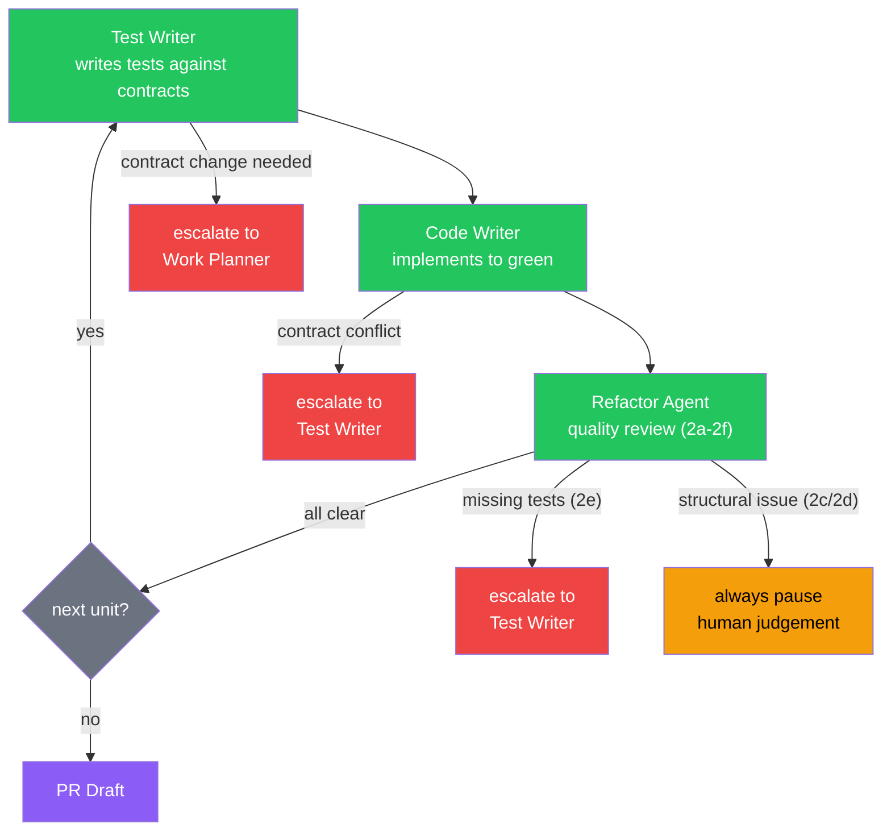
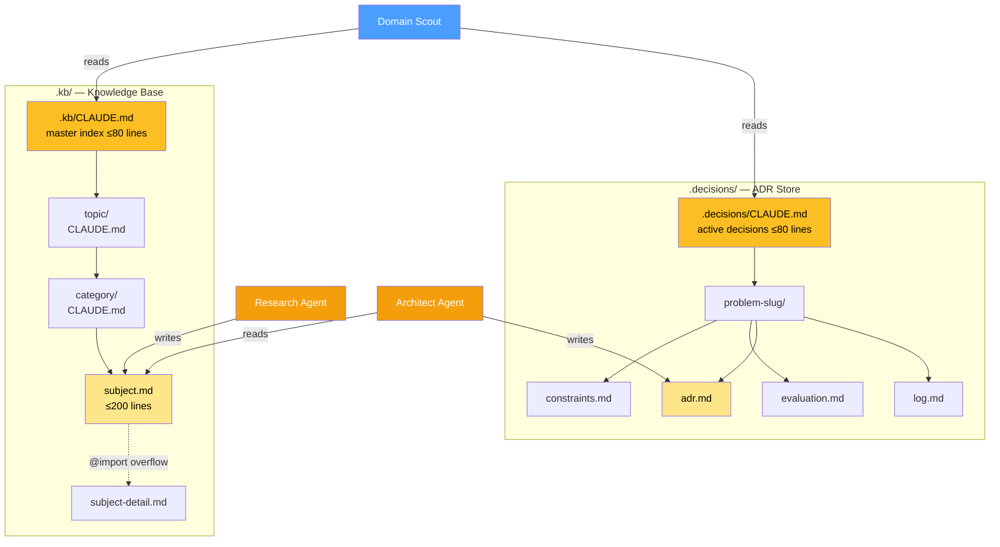
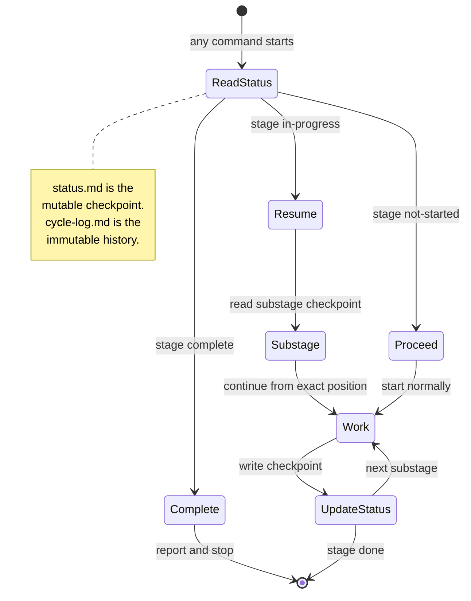

# vallorcine — Design Document

This document describes the design philosophy, core patterns, and structural
decisions behind vallorcine. It is intended for anyone extending the kit,
debugging unexpected agent behaviour, or evaluating whether to adopt it.

---

## What this is

A set of Claude Code slash commands, agent definitions, and rules that turn a
project into a self-documenting, crash-recoverable, TDD-first development
environment. Organised around four concerns:

**Knowledge** — a pull-model knowledge base (`.kb/`) maintained by the Research
Agent. Research findings accumulate across features and are queried on demand.
The KB is independent of any particular feature or decision — it stores what
the project knows.

**Decisions** — an architecture decision store (`.decisions/`) maintained by the
Architect Agent. Each decision goes through a deliberation loop with constraint
profiling, candidate evaluation, and explicit confirmation. Decisions are the
project's governance layer — they record not just what was chosen but why, what
alternatives were rejected, and when to revisit.

**Features** — a staged TDD pipeline that takes a feature description through
scoping, domain analysis, work planning, test writing, implementation, refactor,
PR preparation, and retrospective. Each stage is a separate slash command backed
by a named agent. Features read from the knowledge and decisions layers during
domain analysis and write back via retrospectives — creating a feedback loop
that makes the project layer richer with every feature completed.

**System** — setup, upgrade, project context, and help. One-time configuration
(`/feature-init`, `/setup-vallorcine`), ongoing maintenance (`/upgrade-vallorcine`,
`/project-context`, `/feature-cleanup`), and entry point routing (`/vallorcine-help`).

The knowledge and decisions layers are the durable assets. Features come and go,
but KB entries, ADRs, and project context persist and compound. This is what makes
the 5th feature on a project faster than the 1st.

---

## Core design principles

### 1. Pull model throughout

Nothing loads automatically except the rules in `.claude/rules/` and the root
`CLAUDE.md`. The KB, decision records, feature work files, and agent command
definitions all load on demand only — when Claude explicitly navigates to them.

This means a project with 200 KB entries, 50 ADRs, and 10 active features pays
essentially zero token overhead at session start. The always-loaded footprint is
intentionally fixed: root `CLAUDE.md` (~30 lines) + four rules files (~120 lines
combined). It stays fixed forever regardless of how much content accumulates.

The pull model is enforced by three mechanisms:
- `.kb/` and `.decisions/` are never scanned proactively (rules file prohibits it)
- Slash commands load only the files they need for their specific stage
- Subdirectory `CLAUDE.md` files serve as lazy-loaded indexes rather than
  auto-loaded content

### 2. File-based state, not in-memory state

Claude has no memory between sessions. Everything that needs to survive a session
boundary — current stage, substage, cycle count, work unit status, in-progress
drafts — lives in `.feature/<slug>/status.md`.

`status.md` is updated in-place throughout the pipeline. It is the restart
checkpoint. Every command reads it first and derives its behaviour from it.

`cycle-log.md` is the complement: append-only narrative history. It never lies
about what happened, because nothing is ever deleted from it. `status.md` tells
you where you are; `cycle-log.md` tells you how you got there.

This separation — mutable checkpoint + immutable history — is the same pattern
used in write-ahead logs and event sourcing. It gives idempotency for free:
read the checkpoint, if work is already done, stop.

### 3. Idempotency at every stage

Every command starts by reading `status.md` and checking whether its stage is
already complete. If it is, it reports and stops. No command re-does completed
work without explicit user confirmation.

This makes every command safe to re-run after a crash, a timeout, or an
accidental double-invocation. The pipeline is designed to be interrupted at any
point and resumed cleanly.

The idempotency pattern is:
```
1. Read status.md
2. If stage complete → report and stop
3. If stage in-progress → resume from substage
4. If stage not-started → proceed normally
```

### 4. Write authority is strictly partitioned

Each agent writes only to its designated files. No agent writes to another
agent's output files. This is enforced by explicit rules in each command file
and agent definition, not by technical access controls.

```
Agent              Writes to
─────────────────────────────────────────────────────
Scoping Agent    → .feature/<slug>/brief.md
Domain Scout     → .feature/<slug>/domains.md
Work Planner     → .feature/<slug>/work-plan.md + stub files in src/
Test Writer      → test files + cycle-log.md (test entries)
Code Writer      → implementation files + cycle-log.md (code entries)
Refactor Agent   → implementation files + cycle-log.md (refactor entries)
PR command       → .feature/<slug>/pr-draft.md
Research Agent   → .kb/ only
Architect Agent  → .decisions/ only (reads .kb/)
All agents       → .feature/<slug>/status.md (stage updates only)
```

Escalation paths exist for the cases where one agent discovers a problem that
belongs to another's domain:
- Code Writer finds a contract conflict → escalates to Test Writer (does not modify tests)
- Refactor Agent finds missing tests → escalates to Test Writer (does not write tests)
- Test Writer needs a contract change → escalates to Work Planner (does not modify stubs)

### 5. Tests are the specification

Test files are written before implementation and may never be modified by the
Code Writer. If the implementation can't satisfy a test, that is a signal that
the contract is wrong — handled by escalation to the Test Writer, not by
changing the test to fit the implementation.

This enforces genuine TDD rather than test-after development. The Test Writer
writes tests against work-plan contracts. The Code Writer implements against
those tests. The test files are the ground truth.

### 6. Context is expensive — size every file accordingly

Token cost shapes every structural decision in this kit:

- Always-loaded files (`CLAUDE.md`, rules) are capped and pointer-only
- Index files (`.kb/CLAUDE.md`, `.decisions/CLAUDE.md`) have 80-line hard caps
  with archival rules that enforce them
- Subject files (`.kb/<topic>/<category>/<subject>.md`) are capped at 200 lines
  with overflow extracted to `<subject>-detail.md` via `@import`
- The Work Planner loads only ADR sections and KB key-parameters, not full files
- The Code Writer loads only stub files and test files relevant to the current
  work unit, not the entire feature

The token estimation in the Work Planner's work unit analysis (Step 2b) is a
direct expression of this principle: split only when the savings justify the
overhead. The crossover is ~15K for a single Code Writer session.

### 7. Human confirmation before irreversible writes

Two agents never write their primary output without explicit user confirmation:

**Architect Agent** — presents a defence summary in chat, runs a deliberation
loop, and writes `adr.md` only after the user says "confirmed." An ADR written
without deliberation is not a decision — it's an assumption.

**Scoping Agent** — presents the full feature brief in chat and waits for
confirmation before writing `brief.md`. Brief corrections are cheap; scope
corrections mid-implementation are not.

All other agents write their outputs as part of their normal execution, but
the handoff prompts between stages ("Continue? yes / no") give the user a
review checkpoint before each stage begins.

### 8. Agents are routers, not autonomy machines

The pipeline is explicitly staged and human-paced. Agents do not chain
automatically — they present their output, ask for confirmation, and either
invoke the next sub-agent or stop and give the user a command to run manually.

The `--unit` flag and work unit progression follow the same pattern: the
Refactor Agent reports unit completion and asks whether to continue to the next
unit's test writing. The user stays in the loop at every inter-stage boundary.

`/vallorcine-help` is the clearest expression of this: it reads context, asks one
question, and hands the user a pre-filled command. It never does pipeline work
itself. It is a router, not an agent.

### 9. Agents own the files — users don't edit them directly

Every file written by the kit — `.kb/CLAUDE.md`, `.decisions/CLAUDE.md`,
`status.md`, `brief.md`, ADRs, subject files, index files — carries a managed-by
notice at the top. The notice names the command to use instead of hand-editing.

This is not a technical restriction. It is a workflow discipline. Manual edits
bypass the safety checks agents perform (idempotency reads, cap enforcement,
index consistency, append-only log rules). A manually edited `status.md` can
put the pipeline in an unrecoverable state. A manually edited `.kb/CLAUDE.md`
can break topic resolution in `/research`.

The rule: if you want something to change in a kit-managed file, there is a
slash command for it. If there isn't, that is a gap in the kit — add a command
rather than editing the file directly.

---

## Diagrams

### TDD inner loop and escalation paths



Escalations are strict — an agent never writes to another agent's files.
The Code Writer cannot modify tests; the Refactor Agent cannot write tests;
the Test Writer cannot modify stubs. Each escalation crosses a boundary
that requires the responsible agent to act.

### Knowledge layer architecture



Navigation is top-down when reading (root → topic → category → subject)
and bottom-up when writing (category → topic → root index update). Neither
direction loads more than the navigation path. `.decisions/` links to `.kb/`
via relative paths; `.kb/` never links back — knowledge is independent of
any particular decision.

### Crash recovery model



Every command is idempotent. Re-running after a crash reads the checkpoint,
determines where work stopped, and resumes from that exact substage.
No command re-does completed work without explicit user confirmation.

---

## Structural patterns

### The `.feature/<slug>/` directory

Every feature gets its own directory under `.feature/`. The directory is
gitignored (scratch space); only `project-config.md` and `CLAUDE.md` are
committed (team-shared configuration).

```
.feature/<slug>/
  status.md      ← mutable restart checkpoint (updated in-place)
  brief.md       ← Scoping Agent output (immutable after confirmation)
  domains.md     ← Domain Scout output
  work-plan.md   ← Work Planner output (stubs + contracts)
  cycle-log.md   ← append-only narrative history
  pr-draft.md    ← PR Draft output
```

After the PR merges, `/feature-complete` moves the directory to
`.feature/_archive/<slug>/` (also gitignored, local only).

### The status.md checkpoint fields

```markdown
## Current Position
Stage:     <scoping | domains | planning | testing | implementation | refactor>
Substage:  <fine-grained position within the stage>
Last successful checkpoint: <human-readable description>

## Work Units         ← only present if feature was split
| Unit | Name | Constructs | Depends On | Status | Cycle |

## TDD Cycle Tracker
| Cycle | Unit | Tests written | Tests passing | Refactor done | Missing tests |
```

The substage field enables intra-stage crash recovery — the Refactor Agent
stores which checklist item it was on (2a through 2f) so it can resume exactly
where it stopped.

### Work units

When the Work Planner identifies that a feature has more than ~4 constructs with
a clean dependency boundary (groups that don't depend on each other within the
feature), it proposes splitting into work units. Each unit runs its own
test → implement → refactor cycle independently.

The decision rule is explicit and token-based:
- Single-unit load = N constructs × 3.5K tokens
- Split when single-unit load > 15K AND at least one clean boundary exists
- Never split 1–3 constructs regardless of boundaries

Work units give the Code Writer a bounded context window per session instead of
loading the entire feature at once. The savings are real at 6+ constructs:
~28K single-unit vs ~8-10K per unit session.

Integration tests (2f in the refactor checklist) are deferred until the final
work unit's refactor pass, since they require the complete feature to be in place.

### The KB hierarchy

```
.kb/
  CLAUDE.md                    ← master index, ≤80 lines, lazy-loaded
  _refs/                       ← shared reference fragments (@imported)
  <topic>/
    CLAUDE.md                  ← topic index, lazy-loaded
    <category>/
      CLAUDE.md                ← category index + comparison + gaps, lazy-loaded
      <subject>.md             ← full research, ≤200 lines, read explicitly
      <subject>-detail.md      ← overflow, @imported from subject file
```

The Research Agent navigates this hierarchy bottom-up when writing (category →
topic → root) and Claude navigates it top-down when reading (root → topic →
category → subject). Neither direction loads more than the navigation path.

### The decisions hierarchy

```
.decisions/
  CLAUDE.md                    ← active decisions only, ≤80 lines
  history.md                   ← archived rows, lazy-loaded, grows freely
  <problem-slug>/
    constraints.md             ← six-dimension constraint profile
    research-brief.md          ← Research Agent commission (if needed)
    evaluation.md              ← scored candidate matrix with KB links
    adr.md                     ← confirmed decision record
    log.md                     ← append-only history + deliberation summaries
```

`.decisions/` files always link to `.kb/` files via relative paths. `.kb/`
files never link back to `.decisions/` — knowledge is independent of any
particular decision that uses it.

---

## Token budget at a glance

| What loads | When | Approx. tokens |
|------------|------|----------------|
| Root `CLAUDE.md` | Every session | ~400 |
| `.claude/rules/*.md` (4 files) | Every session | ~1,500 |
| `.feature/project-config.md` | Each pipeline command | ~1,000 |
| `.feature/<slug>/status.md` | Each pipeline command | ~500–1,000 |
| `.feature/<slug>/brief.md` | Domain Scout, Work Planner, Test Writer | ~2,000 |
| `.feature/<slug>/domains.md` | Work Planner | ~3,000 |
| One ADR file | Work Planner, Domain Scout | ~2,000–4,000 |
| One KB subject file | Domain Scout, Architect | ~3,000–5,000 |
| Work-plan (single unit section) | Test Writer, Code Writer | ~2,000 |
| Test files (per unit) | Code Writer | ~2,000–3,000 |
| Stub files (per unit) | Code Writer | ~1,000–2,000 |
| `cycle-log.md` | Status, Resume commands | ~1,000 per cycle entry |

Session start (always paid): ~2,000 tokens, fixed forever.
A typical Code Writer session (single work unit): 6,000–10,000 tokens.
A typical Code Writer session (pre-split, large feature): 15,000–30,000 tokens.

---

## What this kit is not

**Not an autonomous agent loop.** Commands do not chain without user
confirmation. The pipeline is staged and human-paced by design.

**Not a code generator.** The Work Planner writes stubs (contracts with no
implementation). Implementation is the Code Writer's job, guided by tests.

**Not a replacement for code review.** The Refactor Agent's security and
quality checks are a first pass, not a substitute for human review. The PR
draft explicitly includes a review checklist for that reason.

**Not opinionated about language or framework.** Project configuration
(`project-config.md`) is captured at setup time and used to parameterise
agent behaviour. The stub templates cover Python, TypeScript, Go, and Java but
the pattern applies to any language with typed interfaces.

---

## Extension points

**Adding a new pipeline stage** — create a command file in `.claude/commands/`
following the idempotency pattern (read status.md first, check stage, update
substage throughout), add write authority to `tdd-protocol.md`, add the stage
to the status file template in `feature.md`.

**Adding a new KB topic** — no structural change needed. The Research Agent
creates topic directories on first use. Add the topic name to the approved
topics table in `research.md` if it should be suggested by default.

**Adding a new agent** — create an agent definition in `.claude/agents/`,
a command file in `.claude/commands/`, and optionally a rule file in
`.claude/rules/` if the agent needs identity rules loaded every session.
Keep the rule file under 30 lines — it is always loaded.

**Adjusting work unit thresholds** — the 15K crossover and per-construct token
weights are in Step 2b of `feature-plan.md`. Adjust them if your project's
files are consistently larger or smaller than the defaults.

---

## Known team issues

Vallorcine is designed for single-developer use. Team usage works but has known
edge cases. Pre-flight checks (version skew, KB freshness, merge driver setup)
run automatically at pipeline start and handle the most common issues.

### Mitigated

**Index merge conflicts** — `.kb/CLAUDE.md` and `.decisions/CLAUDE.md` are the
narrow conflict surface when multiple developers add KB entries or decisions
concurrently. A custom git merge driver (`merge-driver-index.sh`) auto-resolves
these by keeping all rows from both sides. Registered automatically on first
pipeline command via `ensure-merge-driver.sh`. Scoped via `.gitattributes` to
only vallorcine-managed index files — never affects user code.

**Stale KB reads** — `kb-freshness-check.sh` warns at pipeline start when the
current branch's KB or decisions indexes are behind main. Advisory only.

**Version skew** — `version-check.sh` warns when vallorcine version on the
current branch differs from main.

### Known but not yet mitigated

**ADR contradiction** — two developers can independently accept conflicting ADRs
for the same question. The merge driver ensures both rows land cleanly in the
index, but does not detect the semantic conflict (two `accepted` answers to the
same question). Fix requires a CI check or validation script that scans for
duplicate accepted slugs. See DEFERRED.md.

**Same feature slug on different branches** — `.feature/<slug>/` is gitignored,
so two developers using the same slug have silently divergent local state with
no merge signal. Low probability — avoid by convention: one developer per feature
slug. Branch names include the slug, so `git branch --list` reveals collisions.

**project-config.md overwrite** — running `/feature-init` on separate branches
with different answers causes a merge conflict. Fix is convention: run
`/feature-init` once on main before branching. Documented in `feature-init.md`.

---

## File manifest

```
vallorcine/
│
├── DESIGN.md                        ← this file
├── CONTEXT.md                       ← active session state (bounded ~150-200 lines)
├── SETTLED.md                       ← graduated design history (pull-model reference)
├── COMPETITIVE.md                   ← market positioning (pull-model reference)
├── DEFERRED.md                      ← good-but-not-now ideas (pull-model, local dev only)
├── MANIFEST                         ← list of all kit-managed files (used by upgrade.sh)
├── install.sh                       ← installs to .claude/, .kb/, .decisions/
├── upgrade.sh                       ← downloaded into .claude/; applies new releases
│
├── commands/                        ← slash commands (loaded on invocation only)
│   │
│   │  Knowledge
│   ├── kb.md                        ← /kb — query, lookup, create topics
│   ├── research.md                  ← /research — KB research session
│   │
│   │  Decisions
│   ├── architect.md                 ← /architect — architecture decision session
│   ├── decisions.md                 ← /decisions — query, list, explain, review, backfill, candidates, triage, defer, close
│   │
│   │  Features
│   ├── feature.md                   ← /feature — scoping interview
│   ├── feature-quick.md             ← /feature-quick — small changes, single session
│   ├── feature-domains.md           ← /feature-domains — KB/ADR survey, auto-invokes architect/research
│   ├── feature-plan.md              ← /feature-plan — work plan + stubs + execution strategy
│   ├── feature-coordinate.md        ← /feature-coordinate — parallel batch coordinator
│   ├── feature-test.md              ← /feature-test [--unit] — write failing tests
│   ├── feature-implement.md         ← /feature-implement [--unit] — implement to green
│   ├── feature-refactor.md          ← /feature-refactor [--unit] — quality review (2a-2g)
│   ├── feature-pr.md                ← /feature-pr — PR draft + gh pr create
│   ├── feature-retro.md             ← /feature-retro — post-feature retrospective
│   ├── feature-complete.md          ← /feature-complete — post-merge archival
│   ├── feature-resume.md            ← /feature-resume [--status] [--share] — crash recovery + briefing
│   ├── feature-cleanup.md           ← /feature-cleanup — review stale feature directories
│   ├── feature-init.md              ← /feature-init — project profile setup + branch prompt
│   │
│   │  System
│   ├── vallorcine-help.md           ← /vallorcine-help — entry point, router, question answering
│   ├── setup-vallorcine.md          ← /setup-vallorcine — initialise KB and decisions structure
│   ├── upgrade-vallorcine.md        ← /upgrade-vallorcine — check and apply kit updates
│   └── project-context.md           ← /project-context — team-shared codebase knowledge
│
├── agents/                          ← agent identity definitions
│   ├── scoping-agent.md
│   ├── domain-scout-agent.md
│   ├── work-planner-agent.md
│   ├── test-writer-agent.md
│   ├── code-writer-agent.md
│   ├── refactor-agent.md
│   ├── research-agent.md
│   └── architect-agent.md
│
├── rules/                           ← always-loaded identity + protocol rules
│   ├── tdd-protocol.md              ← pipeline order, write authority, idempotency rule
│   ├── kb-protocol.md               ← pull-model rules for KB and decisions
│   ├── kb-research-agent.md         ← Research Agent identity
│   └── kb-architect.md              ← Architect Agent identity
│
├── scripts/                         ← shell scripts (installed to .claude/scripts/)
│   ├── token-usage.sh               ← per-phase token tracking via session JSONL
│   ├── version-check.sh             ← warns if branch vallorcine version is behind main
│   ├── kb-freshness-check.sh        ← warns if KB/decisions indexes are behind main
│   ├── merge-driver-index.sh        ← git merge driver for CLAUDE.md index files
│   └── ensure-merge-driver.sh       ← registers merge driver on first pipeline run
│
├── tests/                           ← test scripts (not installed)
│   ├── test-install.sh              ← install + upgrade smoke tests
│   ├── scenario-project-config-overwrite.sh
│   ├── scenario-version-skew.sh
│   ├── scenario-version-skew-warning.sh
│   ├── scenario-index-merge-driver.sh
│   ├── scenario-ensure-merge-driver.sh
│   └── scenario-stale-kb.sh
│
├── kb/                              ← seed KB structure
│   ├── CLAUDE.md                    ← KB root index template
│   └── _refs/
│       ├── complexity-notation.md
│       └── benchmarking-methodology.md
│
└── decisions/                       ← seed decisions structure
    └── CLAUDE.md                    ← active decisions index template
```

---

*vallorcine — self-documenting TDD and knowledge management for Claude Code*
