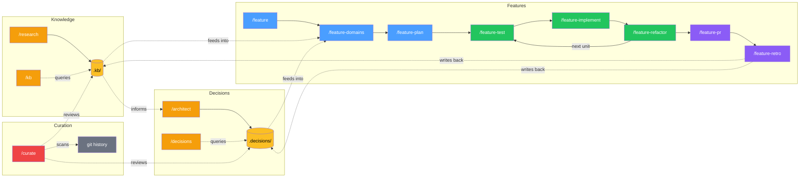

# vallorcine

**A reliable engineering partner for Claude Code that's easy to work with.**

vallorcine enforces the process you want without the friction you don't —
persistent knowledge, structured decisions, TDD guardrails, and a conversational
flow that just tells you what's next. Each feature you ship makes the next one
faster because your project's context compounds, not its token cost.

No dependencies. `bash install.sh` and go.

### Five concerns

**Knowledge** — research findings accumulate in `.kb/` and are queried on demand.
Your project learns once and remembers forever.

**Decisions** — the Architect Agent deliberates tradeoffs and writes ADRs to
`.decisions/`. Decisions compound across features — you don't re-debate settled
questions.

**Features** — TDD pipeline from scoping through PR, with crash recovery and
parallel work unit execution. Claude follows the discipline so you can focus on
directing the work, not policing it.

**Curation** — `/curate` scans your codebase for quality signals: decisions that
no longer match the code, research that's gone stale, implicit dependencies
between features, and areas with no structured knowledge. It connects the dots
that individual features and decisions can't see on their own.

**System** — setup, upgrade, and help. `/vallorcine-help` routes you to the
right command.

---

## How it works



Knowledge and decisions accumulate across features and get richer over time.
Features read from them during domain analysis and write back via retrospectives.
Curation closes the loop — it detects when decisions drift, research goes stale,
or features create implicit dependencies. This feedback loop is what makes the
5th feature on a project faster than the 1st.

---

## Commands by concern

### Knowledge — research and query

| Command | What it does |
|---------|-------------|
| `/kb "<question>"` | Query the knowledge base in plain language |
| `/research <topic> <category> "<subject>"` | Run a research session, writes to `.kb/` |

### Decisions — deliberation and governance

| Command | What it does |
|---------|-------------|
| `/architect "<problem>"` | Full architecture decision session with deliberation |
| `/decisions "<question>"` | Query existing decisions in plain language |
| `/decisions list` | Browse and filter all decisions by status/keyword |
| `/decisions explain "<slug>"` | Plain-language summary with KB context |
| `/decisions review "<slug>"` | Revisit a confirmed decision |
| `/decisions backfill` | Surface undocumented decisions from past work |
| `/decisions candidates` | Review decisions discovered from session transcripts |
| `/decisions triage` | Review all deferred/draft items |
| `/decisions defer "<problem>"` | Park a topic for later |
| `/decisions close "<problem>"` | Rule out permanently |

### Features — TDD pipeline

| Command | What it does |
|---------|-------------|
| `/feature "<description>"` | Start a new feature (full pipeline) |
| `/feature-quick "<description>"` | Small task (single session, no planning) |
| `/feature-resume "<slug>"` | Where am I? What do I run next? |
| `/feature-resume "<slug>" --status` | Detailed session briefing |
| `/feature-resume "<slug>" --list` | List all active features |
| `/feature-domains "<slug>"` | Domain analysis, commissions research/architect |
| `/feature-plan "<slug>"` | Work plan, stubs, execution strategy |
| `/feature-coordinate "<slug>"` | Parallel batch coordinator |
| `/feature-test "<slug>"` | Write failing tests from contracts |
| `/feature-implement "<slug>"` | Implement until tests pass |
| `/feature-refactor "<slug>"` | Quality review (8-item checklist, 2a-2h) |
| `/feature-pr "<slug>"` | Draft PR title, description, checklist |
| `/feature-retro "<slug>"` | Post-feature retrospective |
| `/feature-complete "<slug>"` | Archive after PR merges |
| `/feature-cleanup` | Review stale feature directories |

### Curation — codebase quality over time

| Command | What it does |
|---------|-------------|
| `/curate` | Review quality signals — stale decisions, knowledge gaps, implicit dependencies |
| `/curate --init` | First-time scan on an existing codebase |
| `/curate --deeper` | Scan 6 months of history instead of default 3 |

### System — setup and maintenance

| Command | What it does |
|---------|-------------|
| `/vallorcine-help` | Entry point — routes you to the right command |
| `/vallorcine-help "<question>"` | Answer questions about any command |
| `/feature-init` | One-time project profile setup |
| `/setup-vallorcine` | Initialise `.kb/` and `.decisions/` directories |
| `/upgrade-vallorcine` | Check for and apply kit updates |
| `/project-context add "<entry>"` | Add team-shared codebase knowledge |
| `/project-context cleanup` | Review expired context entries |
| `/project-context` | Display all active context entries |

---

## Install

Two install paths. Same commands, agents, and rules either way.

**Option A — Claude Code plugin (recommended)**

```
/install telefrek/vallorcine
```

Commands and agents are live immediately. No shell required.

**Option B — shell installer (more control)**

```bash
git clone https://github.com/telefrek/vallorcine.git
bash vallorcine/install.sh /path/to/your/project
```

### Differences between install paths

| | Plugin | Shell |
|---|--------|-------|
| **Command names** | `vallorcine:` prefix (e.g. `/vallorcine:feature`) | Unprefixed (e.g. `/feature`) |
| **Upgrade** | `/plugin update vallorcine` | `/upgrade-vallorcine` or `bash install.sh` |
| **Status line + hooks** | Not configured (add manually to `.claude/settings.json`) | Auto-configured by installer |
| **Uninstall** | `/plugin remove vallorcine` | `/uninstall-vallorcine` |
| **Files installed** | Skills, agents, rules only | Skills, agents, rules + scripts, upgrade.sh, version stamp, manifest |

**Plugin prefix:** When installed as a plugin, all commands get a `vallorcine:`
namespace prefix. `/feature` becomes `/vallorcine:feature`, `/kb` becomes
`/vallorcine:kb`, etc. This prevents collisions with other plugins or your own
custom commands. Tab completion works with the prefix.

**Shell unprefixed:** When installed via `bash install.sh`, commands use their
short names (`/feature`, `/kb`, `/architect`). This is simpler if vallorcine is
the only plugin on the project.

**Both paths work together.** If you install via plugin and later want hooks/status
line, add to your project's `.claude/settings.json`:
```json
{
  "hooks": {
    "Stop": [{ "hooks": [{ "type": "command", "command": "bash .claude/scripts/token-stop-hook.sh" }] }]
  },
  "statusLine": { "type": "command", "command": "bash .claude/scripts/statusline.sh" }
}
```

### Post-install setup

Add the following block to your project's root `CLAUDE.md`:

```markdown
## Feature Development
`.feature/<slug>/` — on-demand only. Profile: `.feature/project-config.md`
Quick: `/feature-quick "<description>"` — Full: `/feature "<description>"`
Resume: `/feature-resume "<slug>"` — Status: `/feature-resume "<slug>" --status`
Setup: `/feature-init` (first time only) — Entry point: `/vallorcine-help`

## Knowledge Base & Decisions
`.kb/<topic>/<category>/<subject>.md` and `.decisions/<slug>/adr.md` — on-demand only.
Commands: `/research` `/architect` `/kb` `/decisions`
Setup: `/setup-vallorcine` (first time only)

## Codebase Quality
`/curate` — review quality signals, find stale decisions, knowledge gaps, and implicit dependencies.
`/curate --init` — first-time scan on existing codebase.
```

Run `/feature-init` once to set up the project profile.
Run `/setup-vallorcine` once to initialise the KB and decisions directories.

**Preview changes before installing:**
```bash
bash install.sh --diff /path/to/your/project
```

---

## Usage

**New feature (full pipeline):**
```
/feature "add float16 vector support to the index"
```

**Small task:**
```
/feature-quick "add isActive field to User"
```

**Not sure which to use:**
```
/vallorcine-help
```

**KB research:**
```
/research algorithms vector-indexing "HNSW graph construction"
```

**Architecture decision:**
```
/architect "choose between HNSW and IVF-Flat for approximate nearest neighbour search"
```

**Surface undocumented decisions from past work:**
```
/decisions backfill
```

**Review codebase quality (first time on a project):**
```
/curate --init
```

**Regular curation check (incremental, fast):**
```
/curate
```

---

## Upgrading

**From within a project using the kit:**
```
/upgrade-vallorcine
```
Checks for new releases, shows what changed, and applies with confirmation.
Never touches your `.kb/`, `.decisions/`, or `.feature/` directories.

**Manually (without Claude Code):**
```bash
cd vallorcine && git pull
bash install.sh /path/to/your/project
```

---

## Examples

See [EXAMPLES.md](EXAMPLES.md) for detailed walkthroughs: building a feature
end-to-end, using the autonomous TDD loop, querying the knowledge base,
reviewing past decisions, crash recovery, and more.

---

## Architecture

See [DESIGN.md](DESIGN.md) for the full design reference: the five concerns
model, 10 core principles, token budget, agent write authority table, crash
recovery model, KB/decisions hierarchy, curation architecture, work unit
splitting, and extension points.

## Development

See [CONTEXT.md](CONTEXT.md) for active session context, recent decisions, and open questions.
See [SETTLED.md](SETTLED.md) for stable design history and [COMPETITIVE.md](COMPETITIVE.md) for market positioning.

Use `/ideate` to start a session and `/save-work` to close one.
If a session runs long and quality degrades, close early with `/save-work` and continue fresh — the structured context makes splitting sessions nearly free.

### Local testing

```bash
bash install.sh --dev
```

**Warning:** Do not run `bash install.sh .` from the repo root — the installer
will detect this and block it.

### Versioning

Version is in `VERSION` (semver). Current: 0.5.0
