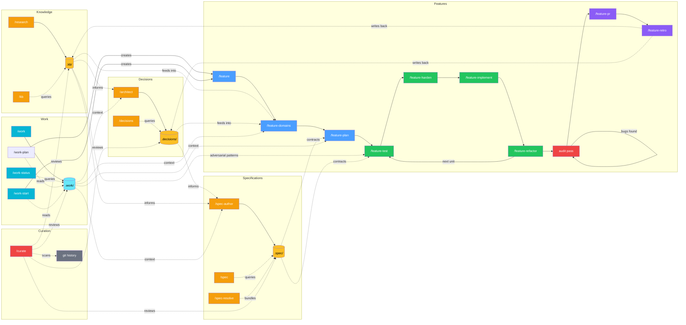

# vallorcine

**A reliable engineering partner for Claude Code that's easy to work with.**

vallorcine gives you structured knowledge, behavioral specifications, TDD
guardrails, multi-feature coordination, and adversarial bug finding — with a
conversational flow that just tells you what's next. Each feature you ship
makes the next one faster because your project's context compounds, not its
token cost.

No dependencies. `bash install.sh` and go.

### Seven concerns

**Knowledge** — research findings accumulate in `.kb/` and are queried on demand.
Your project learns once and remembers forever.

**Decisions** — the Architect Agent deliberates tradeoffs and writes ADRs to
`.decisions/`. Decisions compound across features — you don't re-debate settled
questions.

**Specifications** — behavioral contracts in `.spec/` describe what the system
guarantees. Two-pass adversarial authoring (structured draft + falsification),
displacement detection when new specs contradict existing ones, and a full
lifecycle (DRAFT → APPROVED → INVALIDATED). Specs are the authoritative
reference consumed by the work planner, test writer, and audit pipeline.

**Features** — TDD pipeline from scoping through PR, with spec analysis that
prevents bugs before they're written, an adversarial audit pass that confirms
implementation quality, crash recovery, and parallel work unit execution. Claude
follows the discipline so you can focus on directing the work, not policing it.

**Work** — when work spans multiple features, `/work` decomposes the goal into
work definitions with artifact-based dependencies. Readiness is computed
mechanically — completing one work definition automatically unblocks others.
Supports specification-only and implementation-only pipeline modes.

**Curation** — `/curate` scans your codebase for quality signals: decisions that
no longer match the code, research that's gone stale, specs that have drifted
from implementation, and areas with no structured knowledge. It connects the
dots that individual features and decisions can't see on their own.

**System** — setup, upgrade, and help. `/vallorcine-help` routes you to the
right command.

---

## How it works



Each concern produces durable assets. Features consume knowledge, decisions, and
specs during domain analysis and planning, and write back via retrospectives.
Adversarial findings from each feature's audit pass feed into the next feature's
spec analysis — bug patterns discovered once are prevented in all future features.
Work groups coordinate across features — they make dependency relationships
explicit so the right work happens in the right order. Curation closes the loop,
detecting when decisions drift, specs diverge from code, research goes stale,
or work groups stall. The result: your 5th feature is faster than your 1st.

---

## Commands by concern

### Knowledge — research and query

| Command | What it does |
|---------|-------------|
| `/kb "<question>"` | Query the knowledge base in plain language |
| `/research "<subject>"` | Run a research session — agent determines placement, writes to `.kb/` |

### Decisions — deliberation and governance

| Command | What it does |
|---------|-------------|
| `/architect "<problem>"` | Architecture decision with iterative research, composite candidates, and deliberation |
| `/decisions "<question>"` | Query existing decisions in plain language |
| `/decisions list` | Browse and filter all decisions by status/keyword |
| `/decisions explain "<slug>"` | Plain-language summary with KB context |
| `/decisions revisit "<slug or topic>"` | Revisit decisions — by slug or topic search, with deliberation |
| `/decisions backfill` | Surface undocumented decisions from past work |
| `/decisions candidates` | Review decisions discovered from session transcripts |
| `/decisions triage` | Review all deferred/draft items |
| `/decisions defer "<problem>"` | Park a topic for later |
| `/decisions close "<problem>"` | Rule out permanently |
| `/decisions roadmap` | Cluster, classify, and prioritize deferred decisions into an actionable roadmap |

### Specifications — behavioral contracts

| Command | What it does |
|---------|-------------|
| `/spec "<question>"` | Query specs, discover gaps, and trace change impact |
| `/spec-author "<feature-id>" "<title>"` | Two-pass adversarial spec authoring (structured draft + falsification). Detects INVALIDATED specs for revival as reference input. Loads parent + siblings when amending a child of a layered spec; surfaces a just-in-time `/spec-split` signal when an amendment tips the spec into subdivision territory. |
| `/spec-author "<spec-id>" --depth-pass-only [--lens <name>]` | Re-falsify an APPROVED spec under the current lens corpus (or a specific lens) without re-authoring. Skips Pass 1 / Pass 2; runs Pass 3 only. Use to depth-pass mature specs that predate a newer falsification lens (typically routed from `/curate --verify`). |
| `/spec-write "<id>" "<title>"` | Register a spec in `.spec/` storage with conflict and displacement check |
| `/spec-verify "<id>"` | Verify a spec against the current implementation |
| `/spec-split "<spec-id>"` | Subdivide a mature spec into a parent + concern-specific children. Parent retains cross-cutting requirements; children own concern-specific reqs. Transactional with auto-rollback on validation failure. Triggered by `/curate` housekeeping or `/spec-author` Pass 2 just-in-time signal. |
| `/spec-resolve "<description>"` | Build a resolved context bundle. Detects displacement — when new specs contradict existing APPROVED specs — and presents resolution choices (accept, narrow, defer). Hierarchy-aware: when a child spec lands in candidates, the parent chain auto-includes; `INCLUDE_SIBLINGS=1` opt-in for adversarial paths. |
| `/spec-init` | Initialize the `.spec/` directory structure |

### Features — TDD pipeline

| Command | What it does |
|---------|-------------|
| `/feature "<description>"` | Start a new feature (full pipeline: scoping → domains → specs → plan → test → implement → refactor → audit → PR) |
| `/feature-quick "<description>"` | Small task (single session, no planning) |
| `/feature-resume "<slug>"` | Where am I? What do I run next? |
| `/feature-resume "<slug>" --status` | Detailed session briefing |
| `/feature-resume "<slug>" --list` | List all active features |
| `/feature-domains "<slug>"` | Domain analysis, commissions research/architect. Routes to spec authoring when `.spec/` exists. |
| `/feature-plan "<slug>"` | Work plan, stubs, execution strategy. Consumes specs as primary context. Includes removal work units when displacement is accepted. |
| `/feature-coordinate "<slug>"` | Parallel batch coordinator |
| `/feature-test "<slug>"` | Operationalizes spec requirements into tests (Lens A) + adversarial implementation risk analysis (Lens B) |
| `/feature-harden "<slug>"` | Adversarial test hardening — domain-lens behavioral attacks on contracts before implementation. Auto-selects skip/lite/full. |
| `/feature-implement "<slug>"` | Implement until tests pass. Detects spec conflicts in test failures. |
| `/feature-refactor "<slug>"` | Quality review (8-item checklist), then delegates to `/audit` for adversarial bug finding |
| `/feature-pr "<slug>"` | Draft PR title, description, checklist |
| `/feature-retro "<slug>"` | Post-feature retrospective + narrative article generation. Finalizes displacement by marking displaced specs as INVALIDATED with cross-references. |
| `/feature-complete "<slug>"` | Archive after PR merges |
| `/feature-cleanup` | Review stale feature directories |

### Work — multi-feature coordination

| Command | What it does |
|---------|-------------|
| `/work "<goal>"` | Create a work group — decompose a large goal into coordinated work definitions |
| `/work-decompose "<slug>"` | Break a work group into work definitions with artifact dependencies and shared interface contracts |
| `/work-status "<slug>"` | Show readiness: what is READY, BLOCKED, IN_PROGRESS, or COMPLETE |
| `/work-status --all` | Readiness summary across all active work groups |
| `/work-plan "<slug>" [WD-nn \| next]` | Specify a work definition — domain analysis and spec authoring only |
| `/work-start "<slug>" [WD-nn \| next]` | Implement a specified work definition — implementation pipeline only |

### Audit — adversarial bug finding

| Command | What it does |
|---------|-------------|
| `/audit "<entry-point>"` | Adversarial audit: finds bugs, proves them with tests, fixes the code. Pre-prove gates (dedup reordering, test coverage check) filter findings before expensive prove-fix cycles. Budget-aware with Phase 0 already-fixed detection. Accepts feature slugs, file paths, spec references, or prior reports. |

### Capabilities — project capability index

| Command | What it does |
|---------|-------------|
| `/capabilities "<question>"` | Search capabilities by natural language — "do we support X?" |
| `/capabilities list` | Browse all capabilities organized by domain |
| `/capabilities add "<name>"` | Create a new capability entry with domain placement and type |
| `/capabilities update "<slug>"` | Update an existing capability entry |
| `/capabilities backfill` | Bootstrap from existing features, specs, and ADRs |

### Curation — codebase quality over time

| Command | What it does |
|---------|-------------|
| `/curate` | Review quality signals — stale decisions, knowledge gaps, spec coverage gaps, implicit dependencies, out-of-scope ADR items, **subdivision candidates** (mature specs that have grown past one file's worth of behavior with multiple distinct concerns), **link rot** in KB citations, **falsification-lens staleness** (APPROVED specs predating a newer lens) |
| `/curate --init` | First-time scan on an existing codebase |
| `/curate --deeper` | Scan 6 months of history instead of default 3 |
| `/curate --verify [--analysis <name>]` | Focused pass over verification-shaped candidates (link rot + falsification-lens staleness). Skips the broader correlation flow. Dismissals persist to `.curate/verify-dismissed.txt`. `--analysis` accepts `link-rot`, `falsification-stale`, or `all` (default). |

### System — setup and maintenance

| Command | What it does |
|---------|-------------|
| `/vallorcine-help` | Entry point — routes you to the right command |
| `/vallorcine-help "<question>"` | Answer questions about any command |
| `/setup-vallorcine` | One-time project setup (KB, decisions, feature pipeline, project profile) |
| `/upgrade-vallorcine` | Check for and apply kit updates |
| `/project-context add "<entry>"` | Add team-shared codebase knowledge |
| `/project-context cleanup` | Review expired context entries |
| `/project-context` | Display all active context entries |

---

## Install

Three install paths. Same commands, agents, and rules either way.

**Option A — Claude Code plugin (recommended)**

```
/install telefrek/vallorcine
```

Commands and agents are live immediately. No shell required.

**Option A2 — via the vallorcine marketplace**

```
/plugin marketplace add telefrek/vallorcine
/plugin install vallorcine
```

Useful if you want to pin to the self-hosted marketplace for update control.

**Option B — shell installer (more control)**

```bash
git clone https://github.com/telefrek/vallorcine.git
bash vallorcine/install.sh /path/to/your/project
```

### Differences between install paths

| | Plugin | Shell |
|---|--------|-------|
| **Command names** | `vallorcine:` prefix (e.g. `/vallorcine:feature`) | Unprefixed (e.g. `/feature`) |
| **Upgrade** | `/plugin update vallorcine` | `/upgrade-vallorcine` or `bash install.sh` |
| **Status line + hooks** | Not configured (add manually to `.claude/settings.json`) | Auto-configured by installer |
| **Uninstall** | `/plugin remove vallorcine` | `/uninstall-vallorcine` |
| **Files installed** | Skills, agents, rules only | Skills, agents, rules + scripts, upgrade.sh, version stamp, manifest |

**Plugin prefix:** When installed as a plugin, all commands get a `vallorcine:`
namespace prefix. `/feature` becomes `/vallorcine:feature`, `/kb` becomes
`/vallorcine:kb`, etc. This prevents collisions with other plugins or your own
custom commands. Tab completion works with the prefix.

**Shell unprefixed:** When installed via `bash install.sh`, commands use their
short names (`/feature`, `/kb`, `/architect`). This is simpler if vallorcine is
the only plugin on the project.

**Both paths work together.** If you install via plugin and later want hooks/status
line, add to your project's `.claude/settings.json`:
```json
{
  "hooks": {
    "Stop": [{ "hooks": [{ "type": "command", "command": "bash .claude/scripts/token-stop-hook.sh" }] }]
  },
  "statusLine": { "type": "command", "command": "bash .claude/scripts/statusline.sh" }
}
```

### Post-install setup

Add the following block to your project's root `CLAUDE.md`:

```markdown
## Feature Development
`.feature/<slug>/` — on-demand only. Profile: `.feature/project-config.md`
Quick: `/feature-quick "<description>"` — Full: `/feature "<description>"`
Resume: `/feature-resume "<slug>"` — Status: `/feature-resume "<slug>" --status`
Entry point: `/vallorcine-help`

## Knowledge Base & Decisions
`.kb/<topic>/<category>/<subject>.md` and `.decisions/<slug>/adr.md` — on-demand only.
Commands: `/research` `/architect` `/kb` `/decisions`

## Codebase Quality
`/curate` — review quality signals, find stale decisions, knowledge gaps, and implicit dependencies.
`/curate --init` — first-time scan on existing codebase.
```

Run `/setup-vallorcine` once to set up the project (KB, decisions, feature pipeline, and project profile).

**Preview changes before installing:**
```bash
bash install.sh --diff /path/to/your/project
```

---

## New here? Read this first

- **[GETTING-STARTED.md](GETTING-STARTED.md)** — the mental model: how
  KB / ADRs / specs / features relate, the feature pipeline in plain
  language, when work groups apply, and a "what to run when" decision
  tree.
- **[GETTING-STARTED-EXISTING.md](GETTING-STARTED-EXISTING.md)** — how
  to bring vallorcine into a codebase that already has real history.
  `/curate --init`, the lazy-spec rule, realistic Day 1 / Week 1 /
  Month 1 / Month 3 progression, and common pitfalls.

---

## Usage

**New feature (full pipeline):**
```
/feature "add float16 vector support to the index"
```

**Small task:**
```
/feature-quick "add isActive field to User"
```

**Not sure which to use:**
```
/vallorcine-help
```

**KB research:**
```
/research "HNSW graph construction"
```

**Architecture decision:**
```
/architect "choose between HNSW and IVF-Flat for approximate nearest neighbour search"
```

**Surface undocumented decisions from past work:**
```
/decisions backfill
```

**Coordinate multi-feature work:**
```
/work "migrate auth from session tokens to JWT"
/work-decompose "auth-migration"
/work-status "auth-migration"
/work-plan "auth-migration" next    # specify first ready WD
/work-start "auth-migration" next   # implement a specified WD
```

**Review codebase quality (first time on a project):**
```
/curate --init
```

**Regular curation check (incremental, fast):**
```
/curate
```

---

## Upgrading

**From within a project using the kit:**
```
/upgrade-vallorcine
```
Checks for new releases, shows what changed, and applies with confirmation.
Never touches your `.kb/`, `.decisions/`, or `.feature/` directories.

**Manually (without Claude Code):**
```bash
cd vallorcine && git pull
bash install.sh /path/to/your/project
```

---

## Examples

See [EXAMPLES.md](EXAMPLES.md) for detailed walkthroughs: building a feature
end-to-end, using the autonomous TDD loop, querying the knowledge base,
reviewing past decisions, crash recovery, and more.

---

## Architecture

See [DESIGN.md](DESIGN.md) for the full design reference: the seven concerns
model, 10 core principles, token budget, agent write authority, crash recovery,
knowledge/decisions/specifications hierarchies, work layer architecture,
curation engine, and extension points.

## Development

See [CONTEXT.md](CONTEXT.md) for active session context, recent decisions, and open questions.
See [SETTLED.md](SETTLED.md) for stable design history and [COMPETITIVE.md](COMPETITIVE.md) for market positioning.

Use `/ideate` to start a session and `/save-work` to close one.
If a session runs long and quality degrades, close early with `/save-work` and continue fresh — the structured context makes splitting sessions nearly free.

### Local testing

```bash
bash install.sh --dev
```

**Warning:** Do not run `bash install.sh .` from the repo root — the installer
will detect this and block it.

### Versioning

Version is in `VERSION` (semver). Current: 0.16.3
