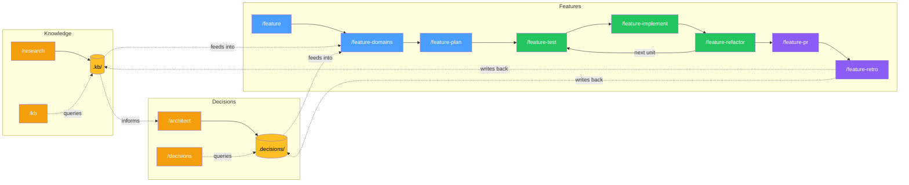

# vallorcine

A Claude Code workflow package built around four concerns:

**Knowledge** — pull-model knowledge base. Research findings accumulate in `.kb/`
and are queried on demand.

**Decisions** — architecture decision store. The Architect Agent deliberates
tradeoffs and writes ADRs to `.decisions/`. Decisions compound across features.

**Features** — TDD pipeline. Scoping → domain analysis → work planning → test →
implement → refactor → PR → retrospective. Crash-recoverable, token-aware,
with parallel work unit execution.

**System** — setup, upgrade, project context, and help. One-time configuration
and ongoing maintenance.

---

## How it works



The knowledge and decisions layers are independent — they accumulate across
features and get richer over time. Features read from them during domain analysis
and write back via retrospectives. The project layer gets more valuable with
every feature completed.

---

## Commands by concern

### Knowledge — research and query

| Command | What it does |
|---------|-------------|
| `/kb "<question>"` | Query the knowledge base in plain language |
| `/research <topic> <category> "<subject>"` | Run a research session, writes to `.kb/` |

### Decisions — deliberation and governance

| Command | What it does |
|---------|-------------|
| `/architect "<problem>"` | Full architecture decision session with deliberation |
| `/decisions "<question>"` | Query existing decisions in plain language |
| `/decisions list` | Browse and filter all decisions by status/keyword |
| `/decisions explain "<slug>"` | Plain-language summary with KB context |
| `/decisions review "<slug>"` | Revisit a confirmed decision |
| `/decisions backfill` | Surface undocumented decisions from past work |
| `/decisions candidates` | Review decisions discovered from session transcripts |
| `/decisions triage` | Review all deferred/draft items |
| `/decisions defer "<problem>"` | Park a topic for later |
| `/decisions close "<problem>"` | Rule out permanently |

### Features — TDD pipeline

| Command | What it does |
|---------|-------------|
| `/feature "<description>"` | Start a new feature (full pipeline) |
| `/feature-quick "<description>"` | Small task (single session, no planning) |
| `/feature-resume "<slug>"` | Where am I? What do I run next? |
| `/feature-resume "<slug>" --status` | Detailed session briefing |
| `/feature-resume "<slug>" --list` | List all active features |
| `/feature-domains "<slug>"` | Domain analysis, commissions research/architect |
| `/feature-plan "<slug>"` | Work plan, stubs, execution strategy |
| `/feature-coordinate "<slug>"` | Parallel batch coordinator |
| `/feature-test "<slug>"` | Write failing tests from contracts |
| `/feature-implement "<slug>"` | Implement until tests pass |
| `/feature-refactor "<slug>"` | Quality review (7-item checklist) |
| `/feature-pr "<slug>"` | Draft PR title, description, checklist |
| `/feature-retro "<slug>"` | Post-feature retrospective |
| `/feature-complete "<slug>"` | Archive after PR merges |
| `/feature-cleanup` | Review stale feature directories |

### System — setup and maintenance

| Command | What it does |
|---------|-------------|
| `/vallorcine-help` | Entry point — routes you to the right command |
| `/vallorcine-help "<question>"` | Answer questions about any command |
| `/feature-init` | One-time project profile setup |
| `/setup-vallorcine` | Initialise `.kb/` and `.decisions/` directories |
| `/upgrade-vallorcine` | Check for and apply kit updates |
| `/project-context add "<entry>"` | Add team-shared codebase knowledge |
| `/project-context cleanup` | Review expired context entries |
| `/project-context` | Display all active context entries |

---

## Install

**Option A — Claude Code plugin (recommended)**

```
/plugin marketplace add telefrek/vallorcine
/plugin install vallorcine
```

Commands and agents are live immediately. No shell required.

**Option B — shell installer (more control)**

```bash
git clone https://github.com/telefrek/vallorcine.git
bash vallorcine/install.sh /path/to/your/project
```

Both options install the same commands, agents, and rules.
The shell installer also installs `upgrade.sh` and the version stamp,
enabling the `/upgrade-vallorcine` command.

Then add the following block to your project's root `CLAUDE.md`:

```markdown
## Feature Development
`.feature/<slug>/` — on-demand only. Profile: `.feature/project-config.md`
Quick: `/feature-quick "<description>"` — Full: `/feature "<description>"`
Resume: `/feature-resume "<slug>"` — Status: `/feature-resume "<slug>" --status`
Setup: `/feature-init` (first time only) — Entry point: `/vallorcine-help`

## Knowledge Base & Decisions
`.kb/<topic>/<category>/<subject>.md` and `.decisions/<slug>/adr.md` — on-demand only.
Commands: `/research` `/architect` `/kb` `/decisions`
Setup: `/setup-vallorcine` (first time only)
```

Run `/feature-init` once to set up the project profile.
Run `/setup-vallorcine` once to initialise the KB and decisions directories.

**Preview changes before installing:**
```bash
bash install.sh --diff /path/to/your/project
```

---

## Usage

**New feature (full pipeline):**
```
/feature "add float16 vector support to the index"
```

**Small task:**
```
/feature-quick "add isActive field to User"
```

**Not sure which to use:**
```
/vallorcine-help
```

**KB research:**
```
/research algorithms vector-indexing "HNSW graph construction"
```

**Architecture decision:**
```
/architect "choose between HNSW and IVF-Flat for approximate nearest neighbour search"
```

**Surface undocumented decisions from past work:**
```
/decisions backfill
```

---

## Upgrading

**From within a project using the kit:**
```
/upgrade-vallorcine
```
Checks for new releases, shows what changed, and applies with confirmation.
Never touches your `.kb/`, `.decisions/`, or `.feature/` directories.

**Manually (without Claude Code):**
```bash
cd vallorcine && git pull
bash install.sh /path/to/your/project
```

---

## Examples

See [EXAMPLES.md](EXAMPLES.md) for detailed walkthroughs: building a feature
end-to-end, using the autonomous TDD loop, querying the knowledge base,
reviewing past decisions, crash recovery, and more.

---

## Architecture

See [DESIGN.md](DESIGN.md) for the full design reference: the four concerns
model, 9 core principles, token budget, agent write authority table, crash
recovery model, KB/decisions hierarchy, work unit splitting, and extension points.

## Development

See [CONTEXT.md](CONTEXT.md) for active session context, recent decisions, and open questions.
See [SETTLED.md](SETTLED.md) for stable design history and [COMPETITIVE.md](COMPETITIVE.md) for market positioning.

Use `/ideate` to start a session and `/save-work` to close one.
If a session runs long and quality degrades, close early with `/save-work` and continue fresh — the structured context makes splitting sessions nearly free.

### Local testing

```bash
bash install.sh --dev
```

**Warning:** Do not run `bash install.sh .` from the repo root — the installer
will detect this and block it.

### Versioning

Version is in `VERSION` (semver). Current: 0.3.0
