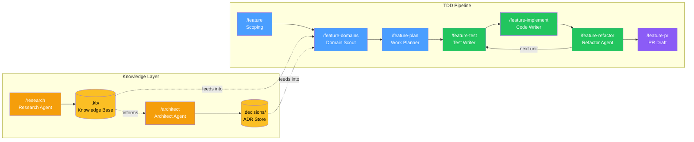

# vallorcine

A Claude Code workflow package. Two subsystems:

**TDD Pipeline** — scoping → domain analysis → work planning → test → implement → refactor → PR.
Crash-recoverable, token-aware, one-question-at-a-time scoping interview.

**KB/Decisions** — pull-model knowledge base and architecture decision store.
Research Agent writes findings to `.kb/`. Architect Agent writes ADRs to `.decisions/`.
Both feed into the TDD pipeline's domain analysis stage.

---

## How it works



The TDD pipeline is staged and human-paced — each stage confirms before
proceeding. The inner loop (test → implement → refactor) can run
autonomously or with manual confirmation at each step. The knowledge layer
is independent: research and decisions accumulate across features and are
pulled in during domain analysis.

---

## Install

**Option A — Claude Code plugin (recommended)**

```
/plugin marketplace add telefrek/vallorcine
/plugin install vallorcine
```

Commands and agents are live immediately. No shell required.

**Option B — shell installer (more control)**

```bash
# Clone and install into a target project
git clone https://github.com/telefrek/vallorcine.git
bash vallorcine/install.sh /path/to/your/project

# Or from within the repo
bash install.sh /path/to/your/project
```

Both options install the same commands, agents, and rules.
The shell installer also installs `upgrade.sh` and the version stamp,
enabling the `/upgrade-vallorcine` command. The plugin path uses native
`/plugin marketplace update` for upgrades instead.

Then add the following block to your project's root `CLAUDE.md`:

```markdown
## Feature Development
`.feature/<slug>/` — on-demand only. Profile: `.feature/project-config.md`
Quick: `/quick "<description>"` — Full: `/feature "<description>"`
Resume: `/feature-resume "<slug>"` — Status: `/feature-resume "<slug>" --status`
Setup: `/feature-init` (first time only) — Entry point: `/vallorcine-help`

## Knowledge Base & Decisions
`.kb/<topic>/<category>/<subject>.md` and `.decisions/<slug>/adr.md` — on-demand only.
Commands: `/research` `/architect` `/kb lookup` `/decisions review`
Setup: `/setup-vallorcine` (first time only)
```

Run `/feature-init` once to set up the project profile.
Run `/setup-vallorcine` once to initialise the KB and decisions directories.

---

## Usage

**New feature (full pipeline):**
```
/feature "add float16 vector support to the index"
```

**Small task:**
```
/quick "add isActive field to User"
```

**Not sure which to use:**
```
/vallorcine-help
```

**KB research:**
```
/research algorithms vector-indexing "HNSW graph construction"
```

**Architecture decision:**
```
/architect "choose between HNSW and IVF-Flat for approximate nearest neighbour search"
```

---

## Upgrading

**From within a project using the kit:**
```
/upgrade-vallorcine
```
Checks for new releases, shows what changed, and applies with confirmation.
Never touches your `.kb/`, `.decisions/`, or `.feature/` directories.

**Manually (without Claude Code):**
```bash
# Pull latest
cd vallorcine && git pull

# Re-install into your project
bash install.sh /path/to/your/project
```

---

## Examples

See [EXAMPLES.md](EXAMPLES.md) for detailed walkthroughs: building a feature
end-to-end, using the autonomous TDD loop, querying the knowledge base,
reviewing past decisions, crash recovery, and more.

---

## Architecture

See [DESIGN.md](DESIGN.md) for the full design reference: the 9 core principles,
token budget, agent write authority table, crash recovery model, KB/decisions
hierarchy, work unit splitting, and extension points.

## Development

See [CONTEXT.md](CONTEXT.md) for active session context, recent decisions, and open questions.
See [SETTLED.md](SETTLED.md) for stable design history and [COMPETITIVE.md](COMPETITIVE.md) for market positioning.

Use `/ideate` to start a session and `/save-work` to close one.
If a session runs long and quality degrades, close early with `/save-work` and continue fresh — the structured context makes splitting sessions nearly free.

### Local testing

```bash
# Install to a temp directory for testing (--dev flag)
bash install.sh --dev

# Opens Claude Code in the temp directory to test commands
# Clean up when done: rm -rf /tmp/...  (path shown in output)
```

**Warning:** Do not run `bash install.sh .` from the repo root — it would
overwrite the source `.claude/commands/` files. The installer will detect
this and block it with an error message.

### Branch workflow

- `main` — stable, versioned releases
- `wip/<topic>` — work in progress, may be broken
- PRs from `wip/` branches into `main` when a set of changes is stable

### Versioning

Version is in `VERSION` (semver). To cut a release, use the dev-only `/release`
command (in `.claude/commands/`, not installed to consumer projects). It bumps
the version, drafts the CHANGELOG entry, builds the release zip, commits, tags,
pushes, and optionally creates a GitHub Release via the `gh` CLI.

---

## Version

See `VERSION`. Current: 0.2.0
